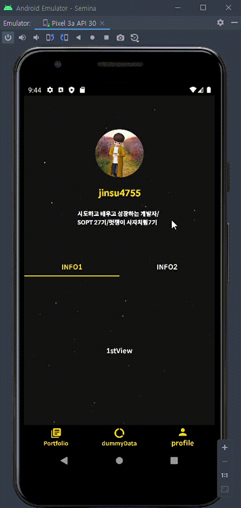

# ✅SOPT_27 Android

> 각 주차마다 branch를 만들어 기록하고있습니다.
>
> Master에서는 가장 마지막의 과제 정보를 담고있습니다. 이전 과제 정보는 branch를 변경하시면 볼 수 있습니다.

| 주차 | 과제 내용        | 과제 README 링크                                             |
| ---- | ---------------- | ------------------------------------------------------------ |
| 1    | 필수,성장1,성장2 | [1차 세미나 과제 README](https://github.com/jinsu4755/AndroidSOPT/blob/week1(MVVM)-login%2CsignUp%2CAutoLogin/SOPT_27th_Android/README.md) |
| 2    | 필수,성장1       | [2차 세미나 과제 README](https://github.com/jinsu4755/AndroidSOPT/blob/week2(MVVM)/SOPT_27th_Android/README.md) |
| 3    | 필수             |                                                              |
| 6    |                  |                                                              |


## 1️⃣2020/10/23 2차 세미나 과제

### ◾ Preview



---

### ◾ Feature

- SignUp
- Login
  - AutoLogin
- Portfolio - github api 연동
  - List Layout
  - Grid Layout
- profile  - github api 연동

---

### ◾ How?

심화 스터디에서 학습한 MVVM을 사용하며 객체지향 생활체조 원칙을 지키기 위해서 노력했습니다.


#### ◾ [필수]  하단탭+뷰페이저 구현(포트폴리오,비어있는화면,프로필)

🥕 : 하단 탭은 android jetpack navigation을 사용하여 작성하였습니다.

```xml
<-- main.xml -->
        <com.google.android.material.bottomnavigation.BottomNavigationView
            android:id="@+id/bottom_navigation_main"
            android:layout_width="match_parent"
            android:layout_height="50dp"
            app:itemIconTint="@color/button_click_yellow_to_white"
            app:itemTextColor="@color/button_click_yellow_to_white"
            app:layout_constraintBottom_toBottomOf="parent"
            app:layout_constraintEnd_toEndOf="parent"
            app:layout_constraintStart_toStartOf="parent"
            app:menu="@menu/menu_main_bottom_navigation" />

        <fragment
            android:id="@+id/nav_host_fragment_main"
            android:name="androidx.navigation.fragment.NavHostFragment"
            android:layout_width="match_parent"
            android:layout_height="0dp"
            app:defaultNavHost="true"
            app:layout_constraintBottom_toTopOf="@+id/bottom_navigation_main"
            app:layout_constraintEnd_toEndOf="parent"
            app:layout_constraintStart_toStartOf="parent"
            app:layout_constraintTop_toTopOf="parent"
            app:navGraph="@navigation/nav_main_host" />
    
<-- menu -->
<menu xmlns:android="http://schemas.android.com/apk/res/android">
    <item android:id="@+id/nav_portfolio"
        android:title="@string/portfolio"
        android:icon="@drawable/ic_baseline_library_books_24"
        />
    <item android:id="@+id/nav_dummy"
        android:title="@string/dummydata"
        android:icon="@drawable/ic_baseline_data_usage_24"/>

    <item android:id="@+id/nav_profile"
        android:title="@string/profile"
        android:icon="@drawable/ic_baseline_person_24"
        />
</menu>
    
<-- nav -->
<navigation xmlns:android="http://schemas.android.com/apk/res/android"
    xmlns:app="http://schemas.android.com/apk/res-auto" android:id="@+id/nav_main_host"
    app:startDestination="@id/nav_portfolio">

    <fragment
        android:id="@+id/nav_portfolio"
        android:name="sopt.onsopt.semina.presentation.main.portfolio.PortfolioFragment"
        android:label="PortfolioFragment" />
    <fragment
        android:id="@+id/nav_dummy"
        android:name="sopt.onsopt.semina.presentation.main.dummy.DummyFragment"
        android:label="DummyFragment" />
    <fragment
        android:id="@+id/nav_profile"
        android:name="sopt.onsopt.semina.presentation.main.profile.ProfileFragment"
        android:label="ProfileFragment" />
</navigation>
```


🥕 : Profile 화면은 Portfolio와 동일하게 GithubApi를 사용하였습니다.

```kotlin
private fun requestUserProfile() {
        GitProfileRequest().apply {
            setOnSuccessListener { onSuccessGetProfile(it) }
        }.send()
    }

    private fun onSuccessGetProfile(profileDTO: ProfileDTO) {
        binding.gitProfile = profileDTO.asDomainModel()
    }
```

onViewCreated 상태에서 서버 호출을 하여 다음과 같으 뷰에 데이터를 넘깁니다.


🥕 : 상단 탭 구현은 세미나와 동일하게 하였습니다.

```kotlin
private fun initViewPager() {
    viewPagerAdapter = ProfileViewPagerAdapter(requireActivity().supportFragmentManager)
    binding.viewPagerInfo.adapter = viewPagerAdapter
    binding.tabLayout.setupWithViewPager(binding.viewPagerInfo)
    binding.tabLayout.apply {
        getTabAt(0)?.text = "INFO1"
        getTabAt(1)?.text = "INFO2"
    }
}
```

```kotlin
class ProfileViewPagerAdapter(
    fragmentManager: FragmentManager
) : FragmentStatePagerAdapter(fragmentManager, BEHAVIOR_RESUME_ONLY_CURRENT_FRAGMENT) {
    override fun getCount(): Int = 2

    override fun getItem(position: Int): Fragment = when (position) {
        0 -> InfoFirstFragment()
        1 -> InfoSecondFragment()
        else -> throw IllegalStateException("존재하지 않는 탭 접근.")
    }
}
```


