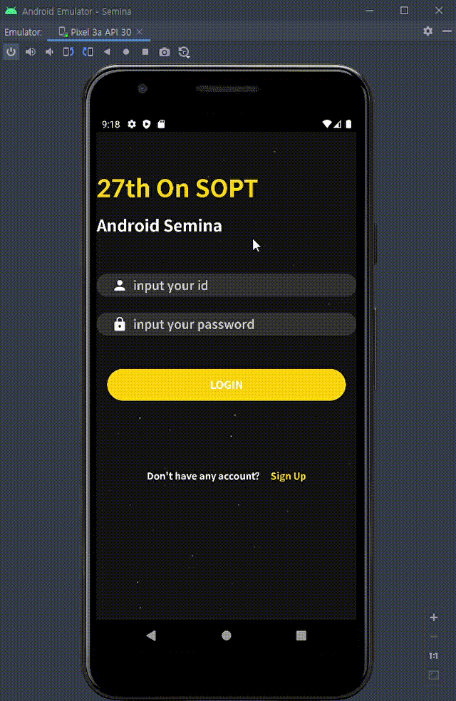

# ✅SOPT_27 Android

> 각 주차마다 branch를 만들어 기록하고있습니다.
>
> Master에서는 가장 마지막의 과제 정보를 담고있습니다. 이전 과제 정보는 branch를 변경하시면 볼 수 있습니다.


## 1️⃣2020/10/23 1차 세미나 과제

### ◾ 화면 및 플로우


---

### ◾ Preview



---

### ◾ Feature

- SignUp
- Login
  - AutoLogin

---

### ◾ How?

심화 스터디에서 학습한 MVVM을 사용하며 객체지향 생활체조 원칙을 지키기 위해서 노력했습니다.


#### ◾ [필수] SignUpActivity 만들기

🥕 데이터가 비었을 경우를 각 EditText마다 검사하고, 전체적으로 회원가입이 완료될 수 있는 상황에 버튼을 활성화 하는것으로 ToastMessage를 대체하였습니다.

**<u>데이터 체크</u>**

```xml 
                <EditText
                    android:id="@+id/sign_up_user_password_edit_text"
                    android:layout_width="0dp"
                    android:layout_height="wrap_content"
                    android:layout_marginStart="16dp"
                    android:hint="Password"
                    android:text="@={signUpViewModel.userPassword}"
                    android:inputType="textPassword"
                    app:layout_constraintEnd_toStartOf="@+id/user_password_result_image"
                    app:layout_constraintStart_toStartOf="parent"
                    app:layout_constraintTop_toTopOf="parent" />   
<!--activity_sign_up.xml -->
```

각각의 EditText는 ViewModel과 양방향 데이터 통신을 합니다.

```kotlin
    private fun userPasswordObserve() {
        signUpViewModel.userPassword.observe(this) {
            signUpViewModel.checkUserPassword()
        }
    }
// SignUpActivity.kt
```

각각의 EditText의 라이브데이터를 관찰하여 변경이 있을때 마다 validate합니다.

```kotlin
    fun checkUserPassword() {
        _isBlankUserPassword.value = userPassword.value?.isBlank()
        validateSignUpInputValueNotNull()
    }

    private fun validateSignUpInputValueNotNull() {
        _isNotNullOrBlankUserData.value = !(isBlankUserName.value ?: true)
                && !(isBlankUserID.value ?: true)
                && !(isBlankUserPassword.value ?: true)
    }
// SignUpViewModel.kt
```

**<u>버튼 활성화</u>**

```xml
        <Button
            android:id="@+id/sign_up_button"
            android:layout_width="match_parent"
            android:layout_height="wrap_content"
            android:layout_marginTop="50dp"
            android:enabled="@{signUpViewModel.isNotNullOrBlankUserData}"
            android:background="@drawable/rounded_button_32dp"
            android:backgroundTint="@color/button_click_yellow_to_white"
            android:textSize="16dp"
            android:textColor="@color/button_click_white_to_black"
            android:text="SIGN UP"
            app:layout_constraintTop_toBottomOf="@id/sign_up_main_form"
            />
<!--activity_sign_up.xml -->
```

각 EditText에서 검사할때마다 `isNotNullOrBlankUserData`가  ViewModel에서 갱신되고 버튼은 해당 데이터와 단방향 통신합니다.


#### ◾ [성장1] 화면이동간 데이터 전달.

🥕 회원가입을 완료하면 로그인 화면으로 데이터를 전달합니다.

**<u>데이터 전달</u>**

```kotlin
    private fun sendSignUpResultAndFinish() {
        setResult(RESULT_OK, createExtraDataIntent())
        finish()
    }

    private fun createExtraDataIntent(): Intent {
        return Intent().apply {
            putExtra("userData", signUpViewModel.createUserDomain())
        }
    }
// SignUpActivity.kt
```

```kotlin
    fun createUserDomain(): UserDomain = UserDomain(
        userName = userName.value,
        userId = userId.value,
        userPassword = userPassword.value
    )
// SignUpViewModel.kt
```

회원가입에서 작성한 정보는 도매인 객체로 래핑하여 Intent에 담아 전달합니다.

```kotlin
data class UserDomain(
    val userName:String?,
    val userId:String?,
    val userPassword:String?,
):Parcelable {
    constructor(parcel: Parcel) : this(
        parcel.readString(),
        parcel.readString(),
        parcel.readString()
    )

    override fun writeToParcel(parcel: Parcel, flags: Int) {
        parcel.writeString(userName)
        parcel.writeString(userId)
        parcel.writeString(userPassword)
    }

    override fun describeContents(): Int {
        return 0
    }

    companion object CREATOR : Parcelable.Creator<UserDomain> {
        override fun createFromParcel(parcel: Parcel): UserDomain {
            return UserDomain(parcel)
        }

        override fun newArray(size: Int): Array<UserDomain?> {
            return arrayOfNulls(size)
        }
    }
}
```

data class를 작성시 각 프로세스 사이에서 데이터를 주고 받을 수 있도록 설계된 Parcel로 만들어주는 Parcelable 인터페이스를 implement하여 엑티비티간 intent 전달시 내부에 해당 데이터 클래스를 Parcel로 만들어 전달 할 수 있도록 하였습니다.

```kotlin
    override fun onActivityResult(requestCode: Int, resultCode: Int, data: Intent?) {
        super.onActivityResult(requestCode, resultCode, data)
        if (requestCode == LoginViewModel.SIGN_UP_REQUEST_CODE && resultCode == RESULT_OK) {
            applyUserData(data?.getParcelableExtra("userData"))
        }
    }

    private fun applyUserData(userData: UserDomain?) {
        userData?.let {
            sendDataToViewModel(it)
            saveDataToRepository(it)
        }
    }

    private fun sendDataToViewModel(userDomain: UserDomain) = loginViewModel.apply {
        editTextId.set(userDomain.userId)
        editTextPassword.set(userDomain.userPassword)
    }
// LoginActivity.kt
```

데이터를 받아오면 ViewModel에 변경사항을 전달하고 View에 표시됩니다.


#### ◾ [성장2] AutoLogin

🥕 데이터를 기억하는 SharedPreference를 제작할때 멀티스레드 환경에서도 안전할 수 있도록 하는 싱글턴 설계를 활용하였으며 해당 객체가 데이터 저장이라는 책임에 맞는 설계를 하였습니다. 회원가입 완료후 받은 사용자 정보 도메인 객체를 이용하여 저장하고 자동로그인합니다.

```kotlin
private fun applyUserData(userData: UserDomain?) {
        userData?.let {
            sendDataToViewModel(it)
            saveDataToRepository(it)
        }
    }

    private fun saveDataToRepository(userDomain: UserDomain) {
        AuthLocalRepository.getInstance(this@LoginActivity)
            .addAllData(userDomain)
    }
// LoginActivity.kt
```

받아온 데이터를 이용하여 ShardPreference에 저장합니다.

```kotlin
class AuthLocalRepository private constructor(context: Context) {
    private val shardPreference =
        context.getSharedPreferences(context.packageName, Activity.MODE_PRIVATE)

    private val editor = shardPreference.edit()

    var userId: String?
        get() = shardPreference.getString(USER_ID, null)
        set(value) = editor.putString(USER_ID, value)
            .apply()

    var userPassword: String?
        get() = shardPreference.getString(USER_PW, null)
        set(value) = editor.putString(USER_PW, value)
            .apply()

    var userName: String?
        get() = shardPreference.getString(USER_NAME, null)
        set(value) = editor.putString(USER_NAME, value)
            .apply()

    fun addAllData(userDomain: UserDomain) = editor.apply {
        putString(USER_ID, userDomain.userId)
        putString(USER_PW, userDomain.userPassword)
        putString(USER_NAME, userDomain.userName)
    }.apply()

    fun removeAllData() = editor.apply {
        remove(USER_ID)
        remove(USER_PW)
        remove(USER_NAME)
    }.commit()

    fun hasUserData(): Boolean = userId?.isNotBlank() ?: false
            && userPassword?.isNotBlank() ?: false
            && userName?.isNotBlank() ?: false


    companion object {
        private const val LOCAL_REPO = "SOPT_Auth"
        private const val USER_ID = "${LOCAL_REPO}_ID"
        private const val USER_PW = "${LOCAL_REPO}_PW"
        private const val USER_NAME = "${LOCAL_REPO}_Name"

        @Volatile
        private var instance: AuthLocalRepository? = null

        fun getInstance(context: Context): AuthLocalRepository = instance ?: synchronized(this) {
            instance ?: AuthLocalRepository(context).apply {
                instance = this
            }
        }
    }
}
```

기본적인 데이터 저장방법을 제외하고 추가된 부분만 설명하면

```kotlin
    fun addAllData(userDomain: UserDomain) = editor.apply {
        putString(USER_ID, userDomain.userId)
        putString(USER_PW, userDomain.userPassword)
        putString(USER_NAME, userDomain.userName)
    }.apply()
```

현재 앱에서 저장될 주요한 회원 정보 객체를 받아서 저장합니다.

```kotlin
    fun hasUserData(): Boolean = userId?.isNotBlank() ?: false
            && userPassword?.isNotBlank() ?: false
            && userName?.isNotBlank() ?: false
```

객체지향 생활체조와 클린코드 학습을 바탕으로 최대한 객체에 메시지를 전달하는 형식을 유지하고 데이터의 검사를 해당 클래스의 역할로 설계했습니다.

```kotlin
 companion object {
        private const val LOCAL_REPO = "SOPT_Auth"
        private const val USER_ID = "${LOCAL_REPO}_ID"
        private const val USER_PW = "${LOCAL_REPO}_PW"
        private const val USER_NAME = "${LOCAL_REPO}_Name"

        @Volatile
        private var instance: AuthLocalRepository? = null

        fun getInstance(context: Context): AuthLocalRepository = instance ?: synchronized(this) {
            instance ?: AuthLocalRepository(context).apply {
                instance = this
            }
        }
    }
```

해당 레포지터리(SharedPreference)는 생성자를 Private으로 닫아주어 자체적으로 인스턴스 제작이 되는 것을 막았습니다.

싱글턴 방식으로 해당 레포지터리의 인스턴스는 메인 메모리에 저장하고 멀티스레드 환경으로 고려하였을때

synchronized를 사용하여 락될 수 있게 하였습니다.

멀티 스레드에서 인스턴스를 얻고자 하면 인스턴스가 있을땐 인스턴스를 던집니다.

그렇지 않은경우 동기화 블럭으로 넘어가게 되고 인스턴스를 생성합니다.

```kotlin
        if (AuthLocalRepository.getInstance(this@LoginActivity).hasUserData()) {
            AuthLocalRepository.getInstance(this@LoginActivity).apply {
                loggingDebug("userInfo","userName:$userName","userId:$userId")
            }
            showToast("Success Auto Login")
            changeMainActivityAndFinish()
        }
//loginActivity.kt
```

레포지터리에 데이터가 있는지 질문을 던지고 있을 경우 자동로그인 합니다.


추가로 들어간 데이터가 잘 나오는지 확인하기 위해서 로그 Util 함수를 제작하고 토스트를 띄울 수 있는 확장함수를 제작했습니다.

```kotlin
fun loggingDebug(vararg logMessages:String) {
    val logMessage = TextUtils.join("\n", logMessages)
    Log.d("jinsu4755:DEBUG",logMessage)
}

fun Activity.showToast(msg: String) {
    Toast.makeText(
        this,
        msg,
        Toast.LENGTH_SHORT
    ).show()
}

```

디버깅 로그를 찍어주는 함수는 가변인자를 사용하여 들어오는 문자열을 줄바꿈으로 출력합니다.


