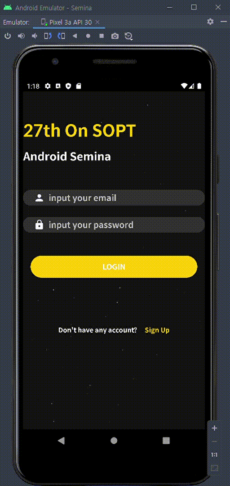

# ✅SOPT_27 Android

> 각 주차마다 branch를 만들어 기록하고있습니다.
>
> Master에서는 가장 마지막의 과제 정보를 담고있습니다. 이전 과제 정보는 branch를 변경하시면 볼 수 있습니다.

| 주차 | 과제 내용        | 과제 README 링크                                             |
| ---- | ---------------- | ------------------------------------------------------------ |
| 1    | 필수,성장1,성장2 | [1차 세미나 과제 README](https://github.com/jinsu4755/AndroidSOPT/blob/week1(MVVM)-login%2CsignUp%2CAutoLogin/SOPT_27th_Android/README.md) |
| 2    | 필수,성장1       | [2차 세미나 과제 README](https://github.com/jinsu4755/AndroidSOPT/blob/week2(MVVM)/SOPT_27th_Android/README.md) |
| 3    | 필수             | [3차 세미나 과제 README](https://github.com/jinsu4755/AndroidSOPT/blob/week3(MVVM)/SOPT_27th_Android/README.md) |
| 6    | 필수             |                                                              |


## 1️⃣2020/12/11 6차 세미나 과제

### ◾ Preview



### ◾ data request and response test with postman


---

### ◾ Feature

- SignUp - server
- Login - server
  - AutoLogin
- Portfolio - github api 연동
  - List Layout
  - Grid Layout
- profile  - github api 연동

---

### ◾ How?

심화 스터디에서 학습한 MVVM을 사용하며 객체지향 생활체조 원칙을 지키기 위해서 노력했습니다.


#### ◾ [필수]  로그인/회원가입 api 적용하기

 ◾ 모든 요청에 대해 실패하면 다음과 같이 Toast 메시지를 띄웁니다. 성공하는 경우는 이전 세미나와 동일하게 flow가 흘러갑니다.
 


🥕 : retrofit interface와 구현체 부분을 따로 두지 않고 인터페이스 내부 동반 객체를 활용하여 동반객체로 하여 interface를 구현하도록 작성하였고 해당 동반 객체는 인터페이스를 싱글턴으로 제공합니다.

```kotlin
interface SOPTService {

    @POST("signup")
    fun requestSignUp(
        @Header("Content-Type") contentType:String = "application/json",
        @Body signUpData:SignUpDomain
    ): Call<BaseResponse<SignUpDTO>>

    @POST("signin")
    fun requestSignIn(
        @Header("Content-Type") contentType:String = "application/json",
        @Body signInData:SignInDomain
    ):Call<BaseResponse<SignInDTO>>

    companion object {
        private const val BASE_URL = "http://15.164.83.210:3000/users/"

        @Volatile
        private var instance: SOPTService? = null

        fun getInstance(): SOPTService = instance ?: synchronized(this) {
            instance ?: provideService(SOPTService::class.java, BASE_URL)
                .apply { instance = this }
        }
    }
}
```

기본적으로 해당 인터페이스를 사용하기 위해서 getInstance를 호출하며 해당 메소드는 인터페이스의 인스턴스를 던져줍니다.


만약 인스턴스가 없다면 멀티스레드 환경에서도 세이프티하게 인스턴스를 제작하여 넘겨줍니다.

```kotlin
val moshi:Moshi = Moshi.Builder()
    .add(KotlinJsonAdapterFactory())
    .build()


fun <T> provideService(clazz: Class<T>, baseUrl: String): T = Retrofit.Builder()
    .baseUrl(baseUrl)
    .addConverterFactory(MoshiConverterFactory.create(moshi))
    .build()
    .create(clazz)
```

provideService 메소드에서 retrofit을 만들고 해당 retrofit을 사용하여 인터페이스를 구현하고 return합니다.


🥕 : 공동 부분은 베이스로 묶었습니다.

```kotlin
data class BaseResponse<T>(
    val status: Int,
    val success: Boolean,
    val message: String,
    val data: T
)
```

공통으로 오는 응답 객체를 만들었으며

```kotlin
abstract class BaseRequest<ResponseAPI> : Callback<ResponseAPI> {

    private var onSuccessListener: ((ResponseAPI) -> Unit)? = null
    private var onErrorListener: ((String?) -> Unit)? = null
    private var onFailureListener: (() -> Unit)? = null

    fun setOnSuccessListener(listener: (ResponseAPI) -> Unit) {
        this.onSuccessListener = listener
    }

    fun setOnErrorListener(listener: (String?) -> Unit) {
        this.onErrorListener = listener
    }

    fun setOnFailureListener(listener: () -> Unit) {
        this.onFailureListener = listener
    }

    fun send() {
        createCall().enqueue(this)
    }

    protected abstract fun createCall(): Call<ResponseAPI>

    override fun onResponse(call: Call<ResponseAPI>, response: Response<ResponseAPI>) {
        if (response.isSuccessful) {
            onSuccessListener?.invoke(response.body() ?: return)
            return
        }
        val errorBody = response.errorBody() ?: return
        val errorMessage = createErrorBody(errorBody)?.message
        onErrorListener?.invoke(errorMessage)
    }

    private fun createErrorBody(errorBody: ResponseBody): GitHubAPIErrorBody? {
        val moshi: Moshi = Moshi.Builder()
            .add(KotlinJsonAdapterFactory())
            .build()
        return moshi.adapter(GitHubAPIErrorBody::class.java).fromJson(errorBody.source())
    }

    override fun onFailure(call: Call<ResponseAPI>, t: Throwable) {
        logFailureMessage(t)
        onFailureListener?.invoke()
    }

    private fun logFailureMessage(t: Throwable) {
        Log.d(SERVER_ERROR_TAG, "${t.message}\n")
        Log.d(SERVER_ERROR_TAG, "${t.localizedMessage}\n")
        Log.d(SERVER_ERROR_TAG, TextUtils.join("\n", t.stackTrace))
    }

    companion object {
        private const val SERVER_ERROR_TAG = "SERVER_ERROR_MESSAGE"
    }
}
```

enqueue까지 호출하는 과정이 공통적인 request 객체를 만드는 부분이기에 공통된 request객체를 만들어 response를 받아오는 부분을 부모 클래스로 엮어 상속하였습니다.

```kotlin
class SignUpRequest(
    private val signUpDomain: SignUpDomain
): SOPTBaseRequest<SignUpDTO>() {
    override fun createCall(): Call<BaseResponse<SignUpDTO>> {
        return SOPTService.getInstance()
            .requestSignUp(
                signUpData = signUpDomain
            )
    }
}
```

자식 클래스에선 부모클래스의 createCall을 구현하며 call객체를 return합니다.

```kotlin
SignUpRequest(signUpViewModel.createUserDomain()).apply {
    setOnSuccessListener { sendSignUpResultAndFinish() }
    setOnErrorListener { showToast(it.toString()) }
}.send()
```

request 요청을 보내기 위해서는 enqueue listener를 달아주고 baseRequest의 send함수를 호출해 enqueue를 호출합니다. 또한 데이터는 뷰모델에서 도메인 객체로 묶어서 전달합니다.


**🥕 :  받아온 데이터를 딱히 사용할 부분이 없기에 초기에 recycler view를 제작시 github api를 이용하였습니다.**

```kotlin
private fun loadPortfolio() {
    GitPortfolioRequest().apply {
        setOnSuccessListener { onSuccessLoadPortfolio(it) }
    }.send()
}

private fun onSuccessLoadPortfolio(portfolioList: List<PortfolioDTO>) {
    val portfolio: List<PortfolioDomain> = portfolioList.map { it.asDomainModel() }
    portfolioAdapter?.addAllData(portfolio)
}
```

데이터를 받아오면 DTO객체를 Domain 객체로 변경함으로 관심사 분리를 하였습니다.


앱 내에서는 반드시 Domain 객체를 사용하며 데이터를 받아오는 DTO는 파싱과 Domain으로 변환의 역할을 책임으로 부여하였습니다.
